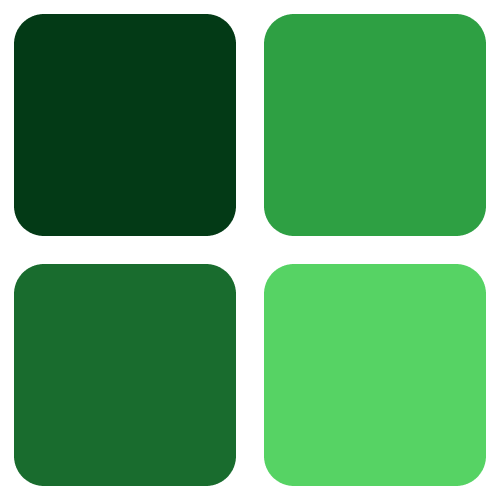
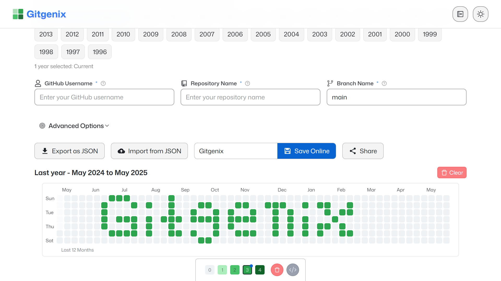
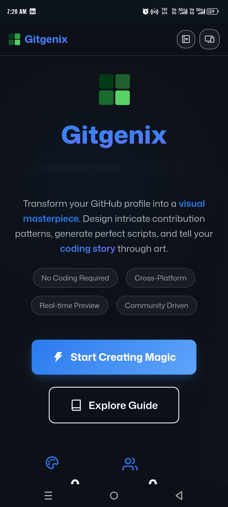
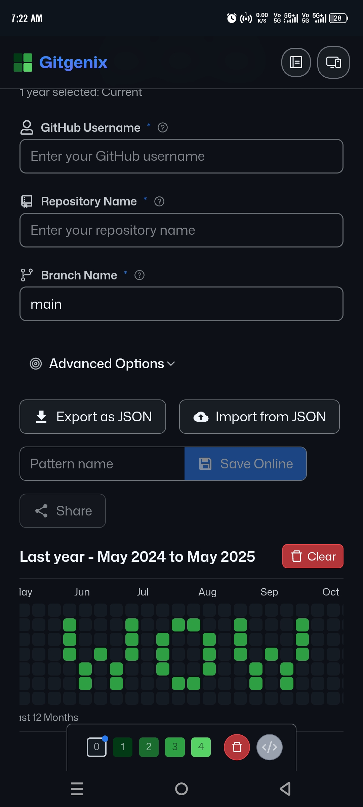
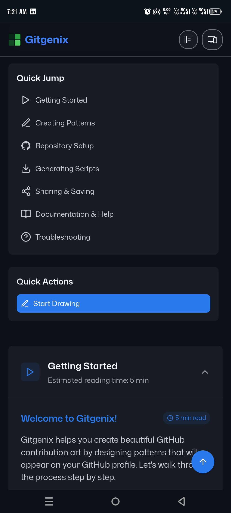
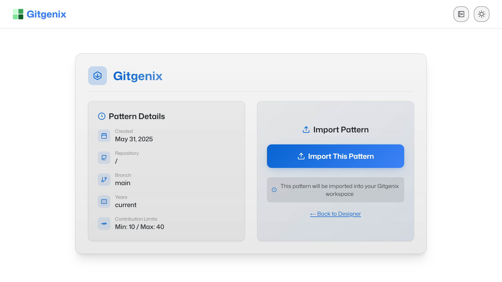
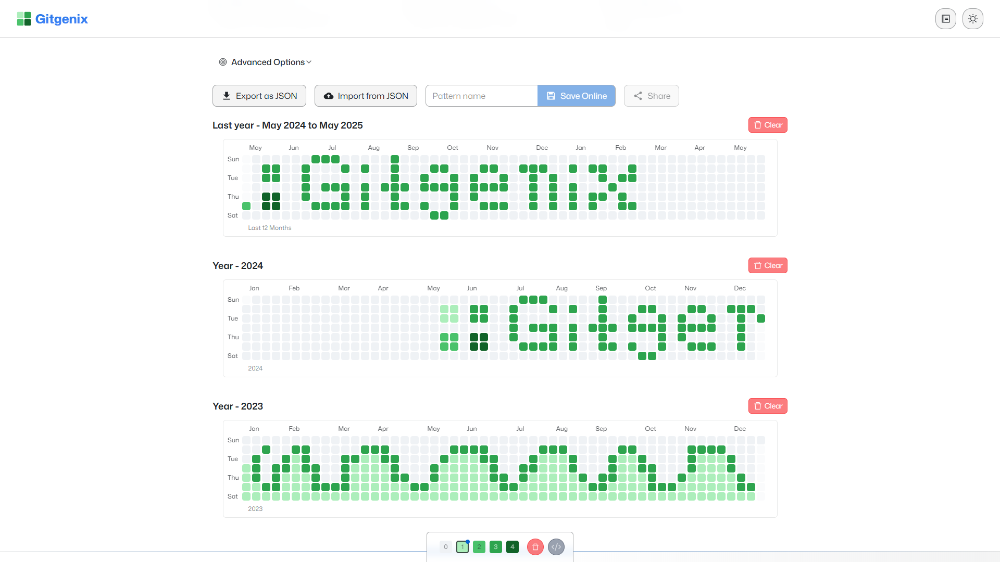

# 🎨 Gitgenix - GitHub Contribution Art Creator

<div align="center">



# Gitgenix

**Transform your GitHub profile into a canvas for beautiful contribution art**

[](https://gitgenix.netlify.app)
[](./LICENSE)
[](https://nextjs.org)
[](https://react.dev)
[](https://typescriptlang.org)
[](https://tailwindcss.com)

**[🎯 Try It Now](https://gitgenix.netlify.app) • [📖 User Guide](./docs/USER_GUIDE.md) • [🚀 Quick Start](./docs/QUICK_START.md) • [📚 Docs](./docs/README.md)**

</div>

---

## ✨ What is Gitgenix?

**Gitgenix** is a powerful, intuitive web application that lets you create stunning pixel art on your GitHub contribution graph. Design patterns, text, shapes, and complex artwork that appears on your GitHub profile, making your coding journey more visually expressive and creative.

### 🎯 Perfect For

- **Developers** who want to personalize their GitHub profiles
- **Creative Coders** looking to combine art with programming
- **Job Seekers** who want their profiles to stand out
- **Students** learning about Git and GitHub
- **Anyone** who loves pixel art and wants to have fun with their GitHub activity

---

## 🚀 Quick Start

### ⚡ 5-Minute Setup

1. **🌐 Visit**: [gitgenix.netlify.app](https://gitgenix.netlify.app)
2. **🎨 Design**: Create your pattern using the visual editor
3. **⚙️ Configure**: Set your GitHub repository details
4. **📥 Generate**: Download your custom shell script
5. **🏃 Execute**: Run the script and watch your art appear!

**New to Gitgenix?** Check out our [Quick Start Guide](./docs/QUICK_START.md) for a detailed walkthrough!

---

## 🌟 Key Features

### 🎨 **Visual Pattern Designer**

- **Intuitive Interface**: Click-and-drag grid with 5 intensity levels
- **Real-time Preview**: See exactly how your pattern will appear on GitHub
- **Mobile Optimized**: Full touch support for tablets and phones
- **Smooth Animations**: Buttery-smooth interactions with Framer Motion

### 📊 **Smart Contribution Control**

- **Custom Limits**: Set minimum (0-100) and maximum (1-1000) daily contributions
- **Intelligent Scaling**: Automatic intensity distribution between your limits
- **Profile Matching**: Blend your art naturally with existing GitHub activity
- **Flexible Patterns**: Create subtle designs or bold, high-contrast artwork

### 🛠️ **Advanced Script Generation**

- **Auto-Repository Detection**: Smart detection of existing repositories
- **GitHub CLI Integration**: Seamless repository creation with `gh` command
- **Cross-Platform Scripts**: Generated for Windows (PowerShell), macOS, and Linux
- **Error Handling**: Built-in validation and fallback mechanisms

### 🌐 **Pattern Sharing & Community**

- **Beautiful Share Pages**: Optimized UI for sharing your creations
- **JSON Export/Import**: Full pattern backup with metadata
- **Social Media Ready**: Rich preview cards for social sharing
- **Community Gallery**: Browse and share patterns with other creators

### 📅 **Multi-Year Support**

- **Expansive Artwork**: Create patterns spanning multiple years
- **Cross-Year Copying**: Duplicate patterns across different years
- **Timeline Planning**: Strategic placement for maximum visibility
- **Complex Animations**: Build time-based visual narratives

### 🚀 **Performance & Accessibility**

- **Lightning Fast**: Optimized rendering for complex patterns
- **Responsive Design**: Works perfectly on all device sizes
- **Reduced Motion**: Respects user accessibility preferences

---

## 🛠️ Technology Stack

<div align="center">

| Frontend       | Backend            | Development  | Deployment       |
| -------------- | ------------------ | ------------ | ---------------- |
| Next.js 15     | Firebase Firestore | TypeScript 5 | Netlify          |
| React 19       | GitHub API         | ESLint       | Automatic Builds |
| Tailwind CSS 3 | Node.js            | Prettier     | CDN              |
| Framer Motion  | -                  | VS Code      | Analytics        |

</div>

### 🔧 Architecture Highlights

- **Modern React**: Latest React 19 with concurrent features
- **Type Safety**: Full TypeScript coverage for reliability
- **Performance First**: Optimized animations and lazy loading
- **SEO Optimized**: Complete sitemap and metadata
- **PWA Ready**: Progressive Web App capabilities

---

## 📸 Screenshots & Demo

<div align="center">

### 🎨 Pattern Designer Interface



### 📱 Mobile Experience





### 🔗 Pattern Sharing



### 📊 Multi-Year View



**[🎥 See Live Demo](https://gitgenix.netlify.app) →**

</div>

---

## 📚 Complete Documentation

### 📖 **User Documentation**

| Guide                                       | Description                        | Best For        |
| ------------------------------------------- | ---------------------------------- | --------------- |
| **[🚀 Quick Start](./docs/QUICK_START.md)** | 5-minute setup guide               | New users       |
| **[📖 User Guide](./docs/USER_GUIDE.md)**   | Comprehensive instructions         | All users       |
| **[❓ FAQ](./docs/FAQ.md)**                 | Common questions & troubleshooting | Problem solving |

### 👨‍💻 **Developer Documentation**

| Guide                                                       | Description               | Best For            |
| ----------------------------------------------------------- | ------------------------- | ------------------- |
| **[🤝 Contributing](./docs/CONTRIBUTING.md)**               | How to contribute code    | Contributors        |
| **[🔧 Development](./docs/DEVELOPMENT.md)**                 | Local setup & development | Developers          |
| **[📚 Developer Reference](./docs/DEVELOPER_REFERENCE.md)** | API docs & architecture   | Advanced developers |
| **[🚀 Deployment](./docs/DEPLOYMENT.md)**                   | Production deployment     | DevOps              |

---

## 🤝 Contributing

We ❤️ contributions! Gitgenix is built by the community, for the community.

### 🌟 **Ways to Contribute**

- 🐛 **Report Bugs**: Help us identify and fix issues
- ✨ **Suggest Features**: Share your ideas for improvements
- 📝 **Improve Docs**: Help others understand Gitgenix better
- 💻 **Write Code**: Implement features and fix bugs
- 🎨 **Design**: Enhance UI/UX and accessibility
- 🧪 **Test**: Improve quality and reliability

### 🚀 **Quick Contributing Steps**

```bash
# 1. Fork the repository on GitHub
# 2. Clone your fork
git clone https://github.com/thesujalpatel/gitgenix.git

# 3. Create a feature branch
git checkout -b feature/amazing-feature

# 4. Make your changes and commit
git commit -m 'feat: add amazing feature'

# 5. Push and create a Pull Request
git push origin feature/amazing-feature
```

**First time contributing?** Look for issues labeled [`good first issue`](https://github.com/thesujalpatel/gitgenix/labels/good%20first%20issue)

**Need help?** Check our [Contributing Guide](./docs/CONTRIBUTING.md) or ask in [Discussions](https://github.com/thesujalpatel/gitgenix/discussions)

---

## 🏆 Community & Recognition

### 🌟 **Contributors**

Thanks to all the amazing people who make Gitgenix better!

<!-- This will be automatically updated -->
<a href="https://github.com/thesujalpatel/gitgenix/graphs/contributors">
  
</a>

### 🎖️ **Show Your Support**

If Gitgenix helps you create amazing GitHub art:

- ⭐ **Star this repository** to show your appreciation
- 🐛 **Report bugs** to help improve the app
- 🎨 **Share your creations** on social media with `#Gitgenix`
- 🤝 **Contribute code** to make it even better
- 💝 **Spread the word** to other developers

---

## 📊 Analytics & Tracking

Gitgenix includes a simple session-based analytics system to track user engagement and provide usage statistics. This helps us improve the application and understand how users interact with it.

- 📈 **Session Analytics**: Track unique visitors and sessions using localStorage
- 🔒 **Privacy-Focused**: All tracking is done locally without external services
- 🛠️ **Simple Setup**: No configuration required - works out of the box
- 📊 **Real-time Stats**: View live statistics in the admin dashboard

### How It Works

- **Unique Visitors**: Tracked using browser localStorage, persisted across sessions
- **Session Tracking**: 30-minute session windows for active usage tracking
- **Happy Developers**: Calculated automatically based on visitor activity and pattern creation
- **Local Caching**: Stats are cached locally for better performance

### Features

- Session-based visitor tracking
- Real-time stats dashboard
- Automatic happy developer calculation
- Local storage for privacy
- No external dependencies

## 📞 Support & Community

### 💬 **Get Help**

- 🐛 **Bug Reports**: [GitHub Issues](https://github.com/thesujalpatel/gitgenix/issues)
- 💭 **Questions & Ideas**: [GitHub Discussions](https://github.com/thesujalpatel/gitgenix/discussions)
- 📖 **Documentation**: [Complete User Guide](./docs/USER_GUIDE.md)
- 🚀 **Quick Help**: [5-Minute Setup Guide](./docs/QUICK_START.md)

### 🌐 **Connect With Us**

- **GitHub**: [@thesujalpatel](https://github.com/thesujalpatel)
- **Website**: [gitgenix.netlify.app](https://gitgenix.netlify.app)
- **Discussions**: [Community Forum](https://github.com/thesujalpatel/gitgenix/discussions)

---

## 📄 License

This project is licensed under the **MIT License** - see the [LICENSE](./LICENSE) file for details.

### 🔓 **What this means:**

- ✅ **Commercial use**: Use in commercial projects
- ✅ **Modification**: Change and adapt the code
- ✅ **Distribution**: Share your modified versions
- ✅ **Private use**: Use for personal projects
- ❗ **License notice**: Include the original license

---

<div align="center">

## 🎨 Ready to Create Art?

**Transform your GitHub profile today!**

[](https://gitgenix.netlify.app)

---

**Built with ❤️ by [Sujal Patel](https://github.com/thesujalpatel) and the [amazing community](https://github.com/thesujalpatel/gitgenix/graphs/contributors)**

_Making GitHub profiles more expressive, one pixel at a time._

**[🎯 Try Now](https://gitgenix.netlify.app) • [📖 Learn More](./docs/USER_GUIDE.md) • [🤝 Contribute](./docs/CONTRIBUTING.md) • [💬 Discuss](https://github.com/thesujalpatel/gitgenix/discussions)**

---

_Star ⭐ this repository if you found it helpful!_

</div>
