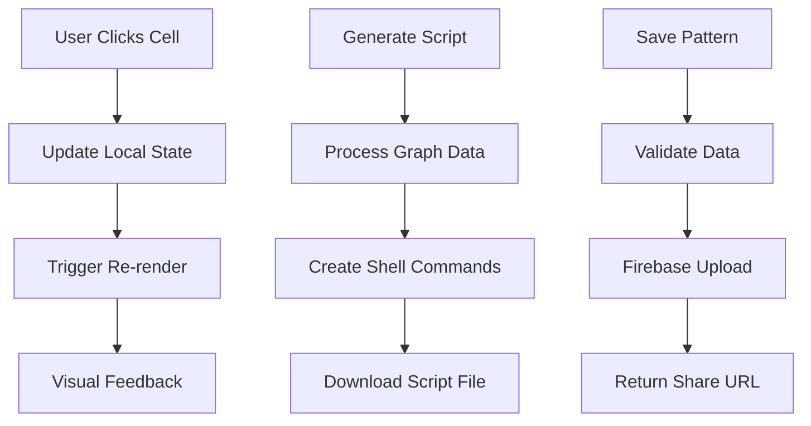

# 🏗️ Gitgenix Architecture Guide

This document provides a comprehensive overview of Gitgenix's technical architecture, design decisions, and system organization.

## Table of Contents

- [System Overview](#system-overview)
- [Technology Stack](#technology-stack)
- [Architecture Patterns](#architecture-patterns)
- [Data Flow](#data-flow)
- [Component Architecture](#component-architecture)
- [State Management](#state-management)
- [Performance Architecture](#performance-architecture)
- [Security Architecture](#security-architecture)
- [Deployment Architecture](#deployment-architecture)

---

## System Overview

### High-Level Architecture

```
┌─────────────────┐    ┌─────────────────┐    ┌─────────────────┐
│   Frontend      │    │   Firebase      │    │   GitHub API    │
│   (Next.js)     │────│   (Firestore)   │    │   (REST)        │
│                 │    │                 │    │                 │
│ • Pattern Editor│    │ • Pattern Store │    │ • Repo Validation│
│ • Script Gen    │    │ • Sharing       │    │ • User Info     │
│ • Animations    │    │ • Real-time     │    │ • Public Data   │
└─────────────────┘    └─────────────────┘    └─────────────────┘
```

### Key Components

1. **Frontend Application** - React-based UI with Next.js
2. **Pattern Storage** - Firebase Firestore for cloud patterns
3. **Script Generation** - Client-side shell script creation
4. **GitHub Integration** - API validation and user experience
5. **Animation System** - Framer Motion with performance optimization

### Design Principles

- **Client-First**: Maximum functionality without server dependency
- **Progressive Enhancement**: Core features work without cloud services
- **Performance-Conscious**: Optimized for low-end devices
- **Accessibility-First**: WCAG 2.1 AA compliance
- **Mobile-Responsive**: Touch-optimized interface

---

## Technology Stack

### Frontend Stack

```typescript
// Core Framework
Next.js 15        // React framework with App Router
React 19          // UI library with latest features
TypeScript 5      // Type-safe JavaScript

// Styling & UI
Tailwind CSS      // Utility-first CSS framework
Framer Motion     // Animation library
React Hot Toast   // Notification system

// State & Data
React Context     // Global state management
Custom Hooks      // Reusable stateful logic
Local Storage     // Client-side persistence

// Build & Development
ESLint           // Code linting
Prettier         // Code formatting
PostCSS          // CSS processing
```

### Backend Services

```typescript
// Cloud Services
Firebase         // Backend-as-a-Service
├── Firestore   // NoSQL document database
├── Hosting     // Static site hosting (alternative)
└── Analytics   // Usage analytics (optional)

// External APIs
GitHub API       // Repository validation
├── REST API    // Public repository data
└── Rate Limits // 60 requests/hour (unauthenticated)

// Deployment
Netlify         // Static site deployment
├── Build       // Automated builds from Git
├── CDN         // Global content delivery
└── Functions   // Serverless functions (if needed)
```

### Development Tools

```bash
# Package Management
npm/yarn         # Dependency management

# Code Quality
ESLint          # Linting and code quality
Prettier        # Code formatting
TypeScript      # Static type checking

# Development
VS Code         # Recommended IDE
React DevTools  # Component debugging
Chrome DevTools # Performance analysis
```

---

## Architecture Patterns

### Component-Based Architecture

```
Application
├── Layout Components (Navigation, Footer)
├── Page Components (Landing, Draw, Guide, Share)
├── Feature Components (ContributionGraph, Toolbar)
├── UI Components (Buttons, Inputs, Modals)
└── Utility Components (LoadingStates, ErrorBoundaries)
```

### Layered Architecture

```
Presentation Layer
├── Pages (Next.js App Router)
├── Components (React Components)
└── Hooks (Custom React Hooks)

Business Logic Layer
├── Utils (Pure Functions)
├── Services (API Interactions)
└── Managers (Animation, Performance)

Data Layer
├── Firebase (Cloud Storage)
├── Local Storage (Browser Persistence)
└── Memory (Runtime State)
```

### Module Federation

```typescript
// Feature-based module organization
app/
├── draw/                  # Drawing feature module
│   ├── components/       # Feature-specific components
│   ├── utils/           # Feature-specific utilities
│   ├── types/           # Feature-specific types
│   └── hooks/           # Feature-specific hooks
├── firebase/            # Firebase service module
├── utils/               # Shared utilities
└── components/          # Shared components
```

---

## Data Flow

### User Interaction Flow



### State Management Flow

```typescript
// State flow diagram
User Action
    ↓
Component Event Handler
    ↓
State Update (useState/useReducer)
    ↓
Component Re-render
    ↓
DOM Update
    ↓
Visual Feedback
```

### Data Transformation Pipeline

```typescript
// Pattern data transformation
User Input (Clicks)
    ↓
Cell State Updates
    ↓
Graph Data Structure
    ↓
JSON Serialization
    ↓
Export/Share/Script Generation
```

---

## Component Architecture

### Component Hierarchy

```
App
├── RootLayout
│   ├── Navigation
│   ├── PageContent
│   │   ├── DrawPage
│   │   │   ├── UserInputs
│   │   │   ├── YearSelector
│   │   │   ├── ContributionGraph
│   │   │   ├── Toolbar
│   │   │   └── DataIO
│   │   ├── GuidePage
│   │   └── SharePage
│   └── Footer
└── Providers
    ├── ToastProvider
    └── ThemeProvider
```

### Component Design Patterns

#### Container/Presentational Pattern

```typescript
// Container Component (Smart)
const ContributionGraphContainer = () => {
  const [graphs, setGraphs] = useState<GraphData[]>([]);
  const [selectedIntensity, setSelectedIntensity] = useState(1);

  const handleCellUpdate = (date: Date, intensity: number) => {
    // Business logic
  };

  return (
    <ContributionGraphPresentation
      graphs={graphs}
      selectedIntensity={selectedIntensity}
      onCellUpdate={handleCellUpdate}
    />
  );
};

// Presentation Component (Dumb)
const ContributionGraphPresentation = ({
  graphs,
  selectedIntensity,
  onCellUpdate,
}) => {
  return <div className="grid">{/* Pure UI rendering */}</div>;
};
```

#### Compound Component Pattern

```typescript
// Main component with sub-components
const Toolbar = ({ children }) => {
  return <div className="toolbar">{children}</div>;
};

Toolbar.IntensitySelector = IntensitySelector;
Toolbar.ClearButton = ClearButton;
Toolbar.Actions = ToolbarActions;

// Usage
<Toolbar>
  <Toolbar.IntensitySelector />
  <Toolbar.ClearButton />
  <Toolbar.Actions />
</Toolbar>;
```

#### Custom Hook Pattern

```typescript
// Reusable stateful logic
const useContributionGraph = (initialYears: number[]) => {
  const [graphs, setGraphs] = useState<GraphData[]>([]);
  const [selectedIntensity, setSelectedIntensity] = useState(1);

  const updateCell = useCallback((date: Date, intensity: number) => {
    // Update logic
  }, []);

  const clearGraph = useCallback((year?: number) => {
    // Clear logic
  }, []);

  return {
    graphs,
    selectedIntensity,
    setSelectedIntensity,
    updateCell,
    clearGraph,
  };
};
```

---

## State Management

### State Architecture

```typescript
// Global State (Context)
interface AppState {
  theme: "light" | "dark" | "system";
  onboardingCompleted: boolean;
  performancePreferences: PerformancePrefs;
}

// Feature State (Local)
interface DrawPageState {
  graphs: GraphData[];
  selectedYears: number[];
  selectedIntensity: number;
  githubSettings: GitHubSettings;
}

// Component State (Local)
interface ComponentState {
  isLoading: boolean;
  error: Error | null;
  isDragging: boolean;
}
```

### State Management Patterns

#### Context for Global State

```typescript
// Theme context
const ThemeContext = createContext<{
  theme: Theme;
  setTheme: (theme: Theme) => void;
}>({
  theme: "system",
  setTheme: () => {},
});

export const ThemeProvider = ({ children }) => {
  const [theme, setTheme] = useState<Theme>("system");

  return (
    <ThemeContext.Provider value={{ theme, setTheme }}>
      {children}
    </ThemeContext.Provider>
  );
};
```

#### Local State for Components

```typescript
// Component-specific state
const ContributionGraph = () => {
  const [graphs, setGraphs] = useState<GraphData[]>([]);
  const [isDragging, setIsDragging] = useState(false);
  const [dragStartCell, setDragStartCell] = useState<Cell | null>(null);

  // State management logic
};
```

#### Custom Hooks for Shared Logic

```typescript
// Reusable stateful logic
const useLocalStorage = <T>(key: string, defaultValue: T) => {
  const [value, setValue] = useState<T>(() => {
    try {
      const item = window.localStorage.getItem(key);
      return item ? JSON.parse(item) : defaultValue;
    } catch {
      return defaultValue;
    }
  });

  const setStoredValue = (value: T) => {
    setValue(value);
    window.localStorage.setItem(key, JSON.stringify(value));
  };

  return [value, setStoredValue] as const;
};
```

---

## Performance Architecture

### Performance Strategy

```typescript
// Performance optimization layers
1. Component Level
   ├── React.memo for expensive components
   ├── useMemo for expensive calculations
   ├── useCallback for stable references
   └── Lazy loading for code splitting

2. Animation Level
   ├── User preference detection
   ├── GPU-accelerated transforms
   ├── Framer Motion optimization
   └── Reduced motion fallbacks

3. Bundle Level
   ├── Dynamic imports
   ├── Code splitting
   ├── Tree shaking
   └── Asset optimization

4. Runtime Level
   ├── Virtual scrolling (if needed)
   ├── Debounced updates
   ├── Memory management
   └── Event delegation
```

### Animation Performance

```typescript
// Performance-aware animation system
const AnimationManager = {
  getPreferences(): AnimationPreferences {
    return {
      preferSimpleAnimations:
        window.matchMedia("(prefers-reduced-motion: reduce)").matches ||
        window.navigator.hardwareConcurrency < 4,
      respectBatteryLevel: "getBattery" in navigator,
    };
  },

  getOptimizedMotionProps(baseProps: MotionProps): MotionProps {
    const prefs = this.getPreferences();
    return prefs.preferSimpleAnimations ? {} : baseProps;
  },
};
```

### Memory Management

```typescript
// Memory optimization patterns
const useEffectWithCleanup = (effect: () => () => void, deps: any[]) => {
  useEffect(() => {
    const cleanup = effect();
    return cleanup;
  }, deps);
};

// Example usage
useEffectWithCleanup(() => {
  const handleResize = () => {
    /* handler */
  };
  window.addEventListener("resize", handleResize);

  return () => window.removeEventListener("resize", handleResize);
}, []);
```

---

## Security Architecture

### Client-Side Security

```typescript
// Input validation and sanitization
const validateGitHubInput = (input: string): boolean => {
  // GitHub username/repo validation
  const pattern = /^[a-zA-Z0-9\-_.]+$/;
  return pattern.test(input) && input.length <= 100;
};

// XSS prevention
const sanitizeOutput = (input: string): string => {
  return input
    .replace(/&/g, "&amp;")
    .replace(/</g, "&lt;")
    .replace(/>/g, "&gt;")
    .replace(/"/g, "&quot;")
    .replace(/'/g, "&#x27;");
};
```

### Firebase Security

```javascript
// Firestore security rules
rules_version = '2';
service cloud.firestore {
  match /databases/{database}/documents {
    match /patterns/{patternId} {
      allow read: if true;
      allow write: if validatePattern(resource.data);
    }
  }
}

function validatePattern(data) {
  return data.keys().hasAll(['name', 'graphs', 'username', 'repository']) &&
         data.name is string &&
         data.name.size() <= 100 &&
         data.graphs is list &&
         data.username is string &&
         data.repository is string;
}
```

### Content Security Policy

```typescript
// Next.js security headers
const securityHeaders = [
  {
    key: "Content-Security-Policy",
    value: `
      default-src 'self';
      script-src 'self' 'unsafe-eval' 'unsafe-inline';
      style-src 'self' 'unsafe-inline';
      img-src 'self' data: https:;
      connect-src 'self' https://firestore.googleapis.com;
    `
      .replace(/\s{2,}/g, " ")
      .trim(),
  },
];
```

---

## Deployment Architecture

### Build Process

```yaml
# Build pipeline
Source Code (GitHub)
↓
Dependency Installation (npm install)
↓
Type Checking (tsc --noEmit)
↓
Linting (eslint)
↓
Build (next build)
↓
Static Export (next export)
↓
Deploy (Netlify)
↓
CDN Distribution
```

### Netlify Configuration

```toml
# netlify.toml
[build]
  publish = "out"
  command = "npm run build && npm run export"

[build.environment]
  NODE_VERSION = "18"

[[redirects]]
  from = "/draw/share/:id"
  to = "/draw/share/:id"
  status = 200

[[headers]]
  for = "/*"
  [headers.values]
    X-Frame-Options = "DENY"
    X-Content-Type-Options = "nosniff"
    Referrer-Policy = "strict-origin-when-cross-origin"
```

### Environment Management

```typescript
// Environment-specific configuration
const config = {
  development: {
    firebase: {
      // Dev Firebase config
    },
    debug: true,
    analytics: false,
  },

  production: {
    firebase: {
      // Prod Firebase config
    },
    debug: false,
    analytics: true,
  },
};

export default config[process.env.NODE_ENV || "development"];
```

---

## Monitoring & Analytics

### Performance Monitoring

```typescript
// Performance tracking
const trackPerformance = () => {
  // Core Web Vitals
  import("web-vitals").then(({ getCLS, getFID, getFCP, getLCP, getTTFB }) => {
    getCLS(console.log);
    getFID(console.log);
    getFCP(console.log);
    getLCP(console.log);
    getTTFB(console.log);
  });
};

// User timing API
performance.mark("pattern-generation-start");
// ... pattern generation code ...
performance.mark("pattern-generation-end");
performance.measure(
  "pattern-generation",
  "pattern-generation-start",
  "pattern-generation-end"
);
```

### Error Tracking

```typescript
// Error boundary for React errors
class ErrorBoundary extends Component {
  constructor(props) {
    super(props);
    this.state = { hasError: false };
  }

  static getDerivedStateFromError(error) {
    return { hasError: true };
  }

  componentDidCatch(error, errorInfo) {
    console.error("React Error:", error, errorInfo);
    // Send to error tracking service
  }

  render() {
    if (this.state.hasError) {
      return <ErrorFallback />;
    }

    return this.props.children;
  }
}
```

---

## Future Architecture Considerations

### Scalability Plans

1. **Server-Side Rendering**: Move to SSR for better SEO
2. **Edge Functions**: Use edge computing for API optimization
3. **Database Optimization**: Implement caching strategies
4. **CDN Strategy**: Optimize asset delivery globally

### Technology Evolution

1. **React Server Components**: Evaluate for performance benefits
2. **Web Workers**: Offload heavy computations
3. **WebAssembly**: Consider for performance-critical operations
4. **Progressive Web App**: Enhanced mobile experience

### Feature Architecture

```typescript
// Future feature architecture
interface FeatureModule {
  components: ComponentMap;
  services: ServiceMap;
  utils: UtilityMap;
  types: TypeDefinitions;
  routes: RouteDefinitions;
}

// Modular feature loading
const loadFeature = async (featureName: string): Promise<FeatureModule> => {
  return import(`./features/${featureName}`);
};
```

---

This architecture guide provides the foundation for understanding and extending Gitgenix. The modular, performance-conscious design ensures the application can grow while maintaining excellent user experience across all devices and use cases.
